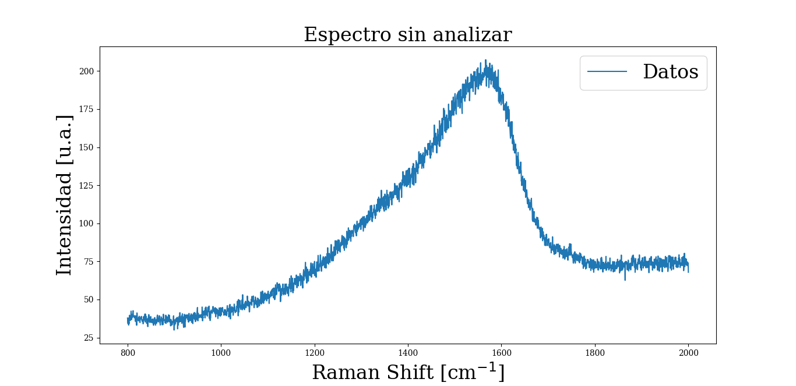

# Análisis de espectros Raman
Este es un código para analizar espectros Raman, según el modelo propuesto por Ferrari _et al._ en el paper _Interpretation of Raman spectra of disordered and amorphous carbon_, consistente en ajustar el pico D con una función lorentziana y el pico G con una función de Breit-Wigner-Fano (BWF). En una primera aproximación, la relación entre las alturas de los picos D y G determina si una estructura es cristalina u amorfa, y esto da información sobre qué propiedades presentará el material.

El análisis de estos espectros se puede separar en dos partes: en la primera se hacen los ajustes con los modelos y se obtienen ciertos parámetros, y en la segunda se decide, en base a esos parámetros, qué tipo de estructura interna presenta la muestra estudiada. Esto se determina manualmente y no es automatizable. Es un análisis sencillo, pero que consume tiempo si se realiza una por una para cada muestra analizada. Este programa automatiza la primera parte del análisis. 

## Programa y funcionamiento
El programa está pensado para que se le indique el path de una carpeta con todos los archivos con los datos (en mi caso eran txt) y devuelva:
- Un Excel con los parámetros de ajuste de los picos D y G y algunas operaciones hechas con esos parámetros (siguiendo el paper de Ferrari)
- Un gráfico por cada espectro analizado
- Un pdf que contiene las figuras de todos los espectros y un gráfico de torta que indica cuantas muestras tuvieron contenido de sp$^3$ mayor a 0.2 y cuantas menor. 

El pdf con las figuras es útil para ver, rápidamente y en un solo lugar, todos los resultados. Si bien a esta altura todavía no se realizó el análisis manual que decide el tipo de estructura, a partir de los gráficos se puede hacer una suposición bastante acertada sobre cómo será la estructura.

## Algunas figuras 
Estos son los datos antes de ser analizados:

Post análisis:

<!-- La idea es que este pdf sea un resumen de todos los resultados. Si bien faltaría la parte manual del análisis, ya viendo los gráficos uno se puede hacer a la idea de más o menos qué estructuras se obtuvieron. -->

<!-- La idea fue automatizar el proceso lo más posible, de forma tal que lo único que hay que hacer es poner el path de la carpeta donde están los archivos y correr el programa. El programa devuelve: -->
<!-- - Parámetros de ajuste de ambos picos y un par de operaciones hechas con esos parámetros, en un Excel.
- Gráficos de cada espectro que se analizó (por separado).
- Un pdf con todos los gráficos y un gráfico de torta que indica cuantas muestras tuvieron 
contenido de sp$^3$ mayor a 0.2 y cuantas menor. -->

<!-- Por cómo es el análisis propuesto, no es posible automatizarlo al 100%. Este script me devuelve todos los datos que necesito para poder finalizar el análisis en forma manual. El pdf es más que nada para ver los resultados todos juntos de forma rápida.  -->

